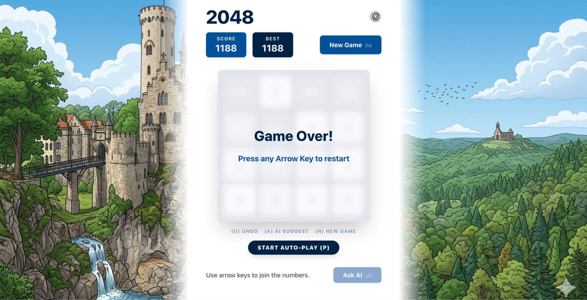
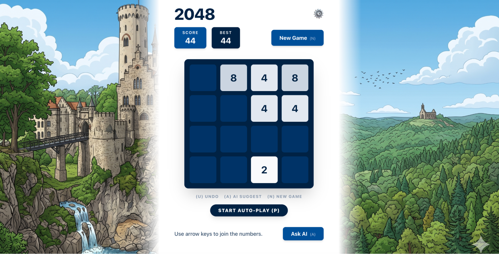
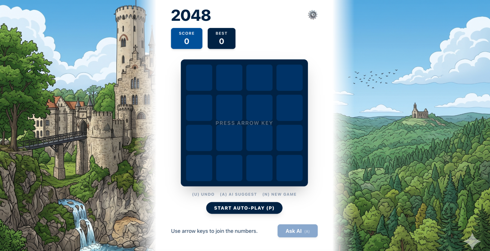
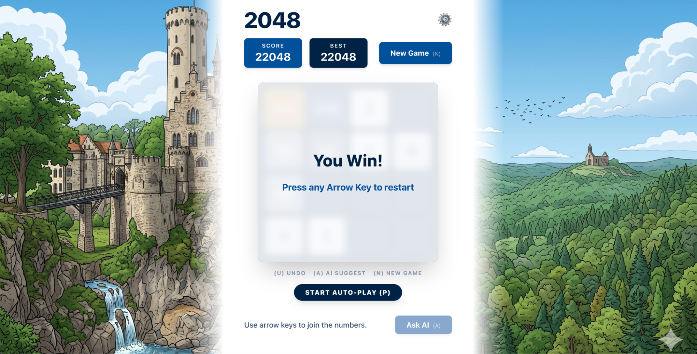
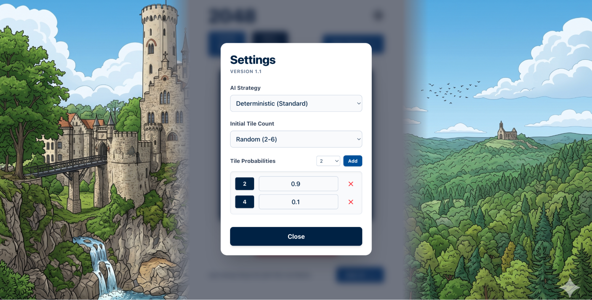

# Play 2048

  
  
  
  
  

A 2048 game built using clean Hexagonal Architecture principles in Java/Spring Boot.

To build and run the entire application stack execute `docker compose up --build` from the root directory; the game will be available at `http://localhost:85`.

# Details

## Back-end

The back-end code is kept under `./src`. 

The package `ch.korotkevics.play2048.domain` is purposefully kept dependency free, it represents the core logic.

Each significant piece of logic is exposed via a facade, and facades are tested in BDD fashion with JGiven (reaching >85% domain line coverage).

Communication with the domain happens via the `ch.korotkevics.play2048.domain.service.DomainEventStream`.

Persistence happens via repositories.

## Front-end

The web client communicates with the server via WebSocket and REST.

The web client is implemented using React Redux / TypeScript.

All significant components are decomposed.

## Further Remarks

In no particular order,

- Realistically, the app doesn't require a proper back-end, but probably a front-end only app would miss the point
- Minor necessary deviations from the standard 2048 game are made default but configurable via `Settings`
- The `Revert` feature wasn't requested but the example had it, I did a variant of it, same goes for `Best Score`
- I wasn't sure what sort of AI was meant to be implemented, therefore I did two - an algo based one (Expectimax), and an LLM based one (Qwen2.5): the first is capable of winning and is fast, the latter is rather incapable of winning and is slow.
- I wanted to test the AI therefore I let myself introduce the `Auto-Play` feature for pure convenience
- I also introduced hotkeys for a few things for faster interaction
- Persistence: it's normally unnecessary to have this for this kind of a game, as much as the back-end overall, it's just for completeness
- The app is obviously created using LLM (Gemini CLI) but under my strict guidance ;)
- Git: Professional source control workflows (branches, PRs, and AI/peer reviews) were bypassed for this scope to keep the project focused and concise.
